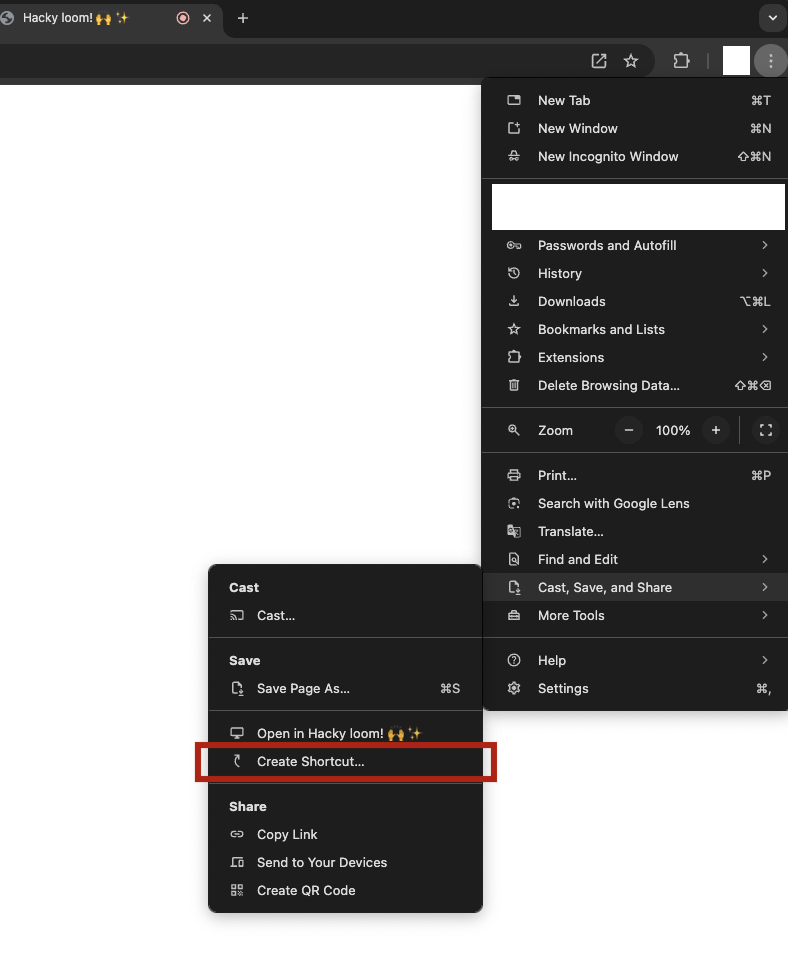

# Hacky Loom

Hacky & lightweight version of [Loom](http://loom.com). 100% free and open source.

## Demo

## Install

1. Visit [JayNakrani.com/hacky-loom.html](https://JayNakrani.com/hacky-loom.html) in chrome.
2. Click three dots on the top right corner, then click "Cast, Save, and Share", then click "Create Shortcut". See the screenshot below.

## How to use

1. Start hacky-loom like any other desktop app.
2. Position the hacky-loom window one of the corners of your screen, and position rest of your windows as your recording use-case requires.
3. Record your screen using your OS's built-in screen recording tool.
4. Share the recordings with others however you'd like.

## Why not use built-in Photo-Booth app?

Photo-Booth app is great but, it has a few limitations which make it less than ideal for loom-style screen recordings.

1. It doesn't allow resizing the window below a certain size, so you're stuck with a large window.
2. It pauses the camera feed if the focus is away from it for a while. This makes it annoying as you have to keep moving the focus back to the Photo-Booth window.
